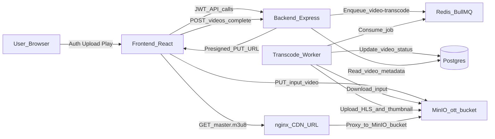

# OTT Streaming MVP - End-to-End Flow and Internal Working

This document explains how your local MVP works internally, from upload to playback, including **how MinIO (S3-compatible storage) and nginx (CDN layer) are connected**.

---

## 1) System Overview

Your stack has these runtime parts:

- **Frontend (React + Vite + Video.js)**  
  User signup/login, upload UI, video list, video player page.
- **Backend API (Node.js + Express + Prisma + JWT)**  
  Auth, upload URL generation, video metadata, queue producer.
- **Queue (BullMQ + Redis)**  
  Decouples upload completion from heavy transcoding.
- **Worker (Node.js + BullMQ + FFmpeg)**  
  Consumes transcode jobs, creates HLS variants/chunks, uploads output.
- **Object Storage (MinIO)**  
  Stores original input video + HLS playlists + `.ts` segments + thumbnail.
- **CDN Layer (nginx in local MVP)**  
  Public playback base URL that proxies reads to MinIO bucket paths.
- **PostgreSQL (via Prisma)**  
  Stores users, videos, status, progress, playback URL, errors.

---

## 2) High-Level Data Flow

---

## 3) Upload and Transcode Flow (Step-by-Step)

### Step A: Auth and token

1. User signs up/logs in via:
   - `POST /auth/signup`
   - `POST /auth/login`
2. Backend returns JWT.
3. Frontend stores JWT and sends it as `Authorization: Bearer <token>` for video APIs.

### Step B: Create signed upload URL

1. Frontend calls `POST /videos/upload-url` with filename/contentType.
2. Backend generates:
   - `videoId` (UUID)
   - `inputKey` like `uploads/{videoId}/input.mp4`
   - presigned `PUT` URL for MinIO/S3
3. Backend returns `{ videoId, inputKey, uploadUrl }`.

### Step C: Browser uploads directly to storage

1. Frontend does `PUT uploadUrl` with video bytes.
2. File is stored in MinIO bucket `ott` at `uploads/{videoId}/...`.
3. Backend is not in the file data path (good for scalability).

### Step D: Upload completion + queue job

1. Frontend calls `POST /videos/complete` with `videoId`, `title`, `inputKey`.
2. Backend inserts `Video` row with:
   - `status=UPLOADED`
   - `inputUrl=s3://ott/{inputKey}`
3. Backend enqueues BullMQ job on queue **`video-transcode`** with payload:
   - `videoId`
   - `bucket`
   - `inputKey`

### Step E: Worker transcoding

Worker picks job and:

1. Updates DB status to `PROCESSING`, progress `0`.
2. Downloads input from MinIO to local temp dir.
3. Runs FFmpeg for HLS renditions (current code uses):
   - **360p**, **720p**, **1080p**
   - H.264 (`libx264`) + AAC audio
   - 4-second segments (`-hls_time 4`)
4. Generates:
   - per-rendition playlists: `360p/index.m3u8`, `720p/index.m3u8`, `1080p/index.m3u8`
   - segment files: `seg_00001.ts`, etc.
   - master playlist (`master.m3u8`) referencing variant playlists
5. Generates thumbnail (`thumbnail.jpg`).
6. Uploads all output to MinIO under:
   - `videos/{videoId}/hls/...`
   - `videos/{videoId}/thumbnail.jpg`
7. Sets `status=READY`, `progress=100`, and:
   - `playbackUrl = {CDN_BASE_URL}/videos/{videoId}/hls/master.m3u8`
   - `thumbnailUrl = {CDN_BASE_URL}/videos/{videoId}/thumbnail.jpg`
8. On failure: `status=FAILED`, persists error text.

---

## 4) Exactly How CDN and MinIO Are Connected

This is the part you asked most about.

### Storage side (MinIO)

- MinIO is your S3-compatible object store.
- Bucket `ott` contains files like:
  - `uploads/{videoId}/input.mp4`
  - `videos/{videoId}/hls/master.m3u8`
  - `videos/{videoId}/hls/720p/seg_00010.ts`

### CDN side (nginx in local)

- Your app gives clients URL with `CDN_BASE_URL` (example `http://localhost:8080`).
- nginx config has:
  - `proxy_pass http://minio:9000/ott/;`

Meaning:

Client requests:

- `http://localhost:8080/videos/abc/hls/master.m3u8`

nginx forwards internally to:

- `http://minio:9000/ott/videos/abc/hls/master.m3u8`

And similarly for every `.m3u8` and `.ts`.

So CDN is not storing files itself in this MVP. It is a **read-through proxy** in front of MinIO.

### Why this matters

- Playback URLs stay stable and storage-provider-agnostic.
- You can later replace nginx local proxy with Cloudflare CDN on same URL contract.
- Browser never needs raw MinIO/S3 URLs for playback.

---

## 5) HLS Playback Chain

When user opens player page:

1. Frontend asks backend `GET /videos/:id`.
2. Backend returns metadata and `playbackUrl`.
3. Video.js requests `master.m3u8`.
4. That file lists variant playlists.
5. Player chooses rendition based on bandwidth/device and fetches `.ts` chunks.
6. Requests go through CDN URL (nginx), then to MinIO objects.

---

## 6) Database Model Behavior

### `User`

- `id`, `email`, `passwordHash`, `createdAt`

### `Video`

- `id`, `title`
- `status`: `UPLOADED | PROCESSING | READY | FAILED`
- `inputUrl`, `inputKey`
- `playbackUrl`, `thumbnailUrl`
- `progress`, `error`, `createdAt`
- `userId` relation

Lifecycle:

- upload complete -> `UPLOADED`
- worker starts -> `PROCESSING`
- worker success -> `READY`
- worker error -> `FAILED`

---

## 7) API Contract Summary

Auth:

- `POST /auth/signup`
- `POST /auth/login`

Videos (JWT required):

- `POST /videos/upload-url` -> returns signed PUT URL
- `POST /videos/complete` -> creates DB row + enqueues job
- `GET /videos` -> list user videos
- `GET /videos/:id` -> video metadata + playback URL
- `DELETE /videos/:id` -> deletes uploaded source + HLS output + DB row

---

## 8) Why Queue + Worker (instead of direct sync encoding in API)

- Upload completion API stays fast.
- CPU-heavy FFmpeg work runs asynchronously.
- You can scale worker instances independently.
- Retry policies and backoff are managed by BullMQ.

---

## 9) Local Dev Networking Notes

From Docker network:

- nginx reaches MinIO by service name: `minio:9000`.

From your browser:

- frontend: `localhost:5173`
- backend: `localhost:4000`
- cdn proxy: `localhost:8080`
- minio api: `localhost:9000`
- minio console: `localhost:9001`

---

## 10) Current MVP vs Production

What this MVP already does well:

- direct-to-storage upload
- async transcode queue
- adaptive HLS ladder
- CDN-fronted playback URL design
- status/progress tracking

Typical production improvements:

- private bucket + signed CDN URLs/tokens
- multi-worker autoscaling
- persistent FFmpeg telemetry/events
- distributed cache and CDN edge tuning
- DRM/encryption and access control
- robust observability (metrics, traces, alerts)

---

## 11) Quick Mental Model (one paragraph)

Think of your system as: **API controls metadata and orchestration**, **MinIO stores all media bytes**, **BullMQ decides when encoding runs**, **worker converts one source video into HLS assets**, and **nginx acts as a public media gateway (CDN base URL) that fetches those assets from MinIO on demand**. The player only talks to the CDN URL; CDN talks to object storage; backend tells player where to start (`master.m3u8`).

